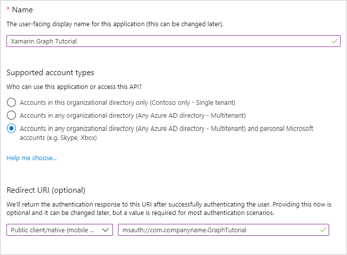
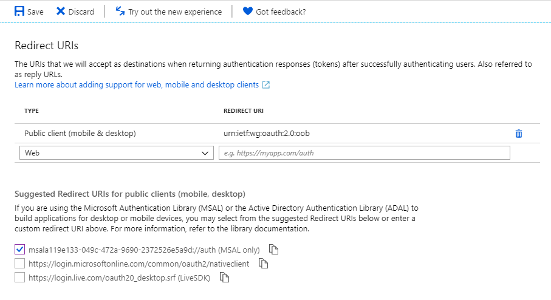

# Exécution du projet terminéHow to run the completed project

## Conditions préalablesPrerequisites

Pour exécuter le projet terminé dans ce dossier, vous avez besoin des éléments suivants :To run the completed project in this folder, you need the following:

- [Visual Studio](https://visualstudio.microsoft.com/vs/) installé sur votre ordinateur de développement.[Visual Studio](https://visualstudio.microsoft.com/vs/) installed on your development machine. (**Remarque :** ce didacticiel a été écrit avec visual studio 2017 version 15.9.6 et Visual Studio pour Mac version 7.7.4.(**Note:** This tutorial was written with Visual Studio 2017 version 15.9.6 and Visual Studio for Mac version 7.7.4. Les étapes de ce guide peuvent fonctionner avec d’autres versions, mais cela n’a pas été testé.)The steps in this guide may work with other versions, but that has not been tested.)
- Xamarin installé dans le cadre de votre installation de Visual Studio.Xamarin installed as part of your Visual Studio installation. Consultez la rubrique [installation de Xamarin](https://docs.microsoft.com/xamarin/cross-platform/get-started/installation) pour obtenir des instructions sur l’installation et la configuration de Xamarin.See [Installing Xamarin](https://docs.microsoft.com/xamarin/cross-platform/get-started/installation) for instructions on installing and configuring Xamarin.
- Soit un compte Microsoft personnel avec une boîte aux lettres sur Outlook.com, soit un compte professionnel ou scolaire Microsoft.Either a personal Microsoft account with a mailbox on Outlook.com, or a Microsoft work or school account.

Si vous n’avez pas de compte Microsoft, vous disposez de deux options pour obtenir un compte gratuit :If you don't have a Microsoft account, there are a couple of options to get a free account:

- Vous pouvez vous [inscrire pour obtenir un nouveau compte Microsoft personnel](https://signup.live.com/signup?wa=wsignin1.0&rpsnv=12&ct=1454618383&rver=6.4.6456.0&wp=MBI_SSL_SHARED&wreply=https://mail.live.com/default.aspx&id=64855&cbcxt=mai&bk=1454618383&uiflavor=web&uaid=b213a65b4fdc484382b6622b3ecaa547&mkt=E-US&lc=1033&lic=1).You can [sign up for a new personal Microsoft account](https://signup.live.com/signup?wa=wsignin1.0&rpsnv=12&ct=1454618383&rver=6.4.6456.0&wp=MBI_SSL_SHARED&wreply=https://mail.live.com/default.aspx&id=64855&cbcxt=mai&bk=1454618383&uiflavor=web&uaid=b213a65b4fdc484382b6622b3ecaa547&mkt=E-US&lc=1033&lic=1).
- Vous pouvez vous [inscrire au programme pour les développeurs office 365](https://developer.microsoft.com/office/dev-program) pour obtenir un abonnement gratuit à Office 365.You can [sign up for the Office 365 Developer Program](https://developer.microsoft.com/office/dev-program) to get a free Office 365 subscription.

## Enregistrer une application avec le portail AzureRegister an application with the Azure Portal

1. Ouvrez un navigateur et accédez au [Centre d’administration Azure Active Directory](https://aad.portal.azure.com).Open a browser and navigate to the [Azure Active Directory admin center](https://aad.portal.azure.com). Connectez-vous à l’aide d’un **compte personnel** (compte Microsoft) ou d’un **compte professionnel ou scolaire**.Login using a **personal account** (aka: Microsoft Account) or **Work or School Account**.

1. Sélectionnez **Nouvelle inscription**.Select **New registration**. Sur la page **Inscrire une application**, définissez les valeurs comme suit.On the **Register an application** page, set the values as follows.

    - Définissez le **Nom** sur `Xamarin Graph Tutorial`.Set **Name** to `Xamarin Graph Tutorial`.
    - Définissez les **Types de comptes pris en charge** sur **Comptes dans un annuaire organisationnel et comptes personnels Microsoft**.Set **Supported account types** to **Accounts in any organizational directory and personal Microsoft accounts**.
    - Laissez **Redirect URI** vide.Leave **Redirect URI** empty.

    

1. Choisissez **Inscrire**.Choose **Register**. Sur la page **Xamarin Graph Tutorial** , copiez la valeur de l' **ID d’application (client)** et enregistrez-la, vous en aurez besoin à l’étape suivante.On the **Xamarin Graph Tutorial** page, copy the value of the **Application (client) ID** and save it, you will need it in the next step.

    

1. Sélectionnez le lien **Ajouter un URI de redirection** .Select the **Add a Redirect URI** link. Sur la page **URI de redirection** , recherchez la section **URI de redirection suggérée pour les clients publics (mobile, bureau)** .On the **Redirect URIs** page, locate the **Suggested Redirect URIs for public clients (mobile, desktop)** section. Sélectionnez l’URI qui commence par `msal` **et** l’URI **urn : IETF : WG : OAuth : 2.0 : OOB** .Select the URI that begins with `msal` **and** the **urn:ietf:wg:oauth:2.0:oob** URI. Copiez la valeur qui commence `msal`par, puis choisissez **Enregistrer**.Copy the value that begins with `msal`, then choose **Save**. Enregistrez l’URI de redirection copié, vous en aurez besoin à l’étape suivante.Save the copied redirect URI, you will need it in the next step.

    

## Configurer l’exempleConfigure the sample

1. Renommez `./GraphTutorial/GraphTutorial/Models/OAuthSettings.cs.example` le fichier `OAuthSettings.cs`.Rename the `./GraphTutorial/GraphTutorial/Models/OAuthSettings.cs.example` file to `OAuthSettings.cs`.
1. Modifiez le `OAuthSettings.cs` fichier et effectuez les modifications suivantes.Edit the `OAuthSettings.cs` file and make the following changes.
    1. Remplacez `YOUR_APP_ID_HERE` par l' **ID d’application** que vous avez obtenu à partir du portail Azure.Replace `YOUR_APP_ID_HERE` with the **Application Id** you got from the Azure portal.
1. Dans le projet **GraphTutorial. iOS** , ouvrez le `Info.plist` fichier.In the **GraphTutorial.iOS** project, open the `Info.plist` file.
    1. Sous l’onglet **avancé** , recherchez la section **types d’URL** .On the **Advanced** tab, locate the **URL Types** section. Dans la valeur des **schémas** d’URL `YOUR_APP_ID_HERE` , remplacez par l' **ID d’application** que vous avez obtenu à partir du portail Azure.In the **URL Schemes** value, replace `YOUR_APP_ID_HERE` with the **Application Id** you got from the Azure portal.
1. Dans le projet **GraphTutorial. Android** , ouvrez le `Properties/AndroidManifest.xml` fichier.In the **GraphTutorial.Android** project, open the `Properties/AndroidManifest.xml` file.
    1. Remplacez `YOUR_APP_ID_HERE` par l' **ID d’application** que vous avez obtenu à partir du portail Azure.Replace `YOUR_APP_ID_HERE` with the **Application Id** you got from the Azure portal.

## Exécution de l’exempleRun the sample

Dans Visual Studio, appuyez sur **F5** ou choisissez **débogage > démarrer le débogage**.In Visual Studio, press **F5** or choose **Debug > Start Debugging**.
