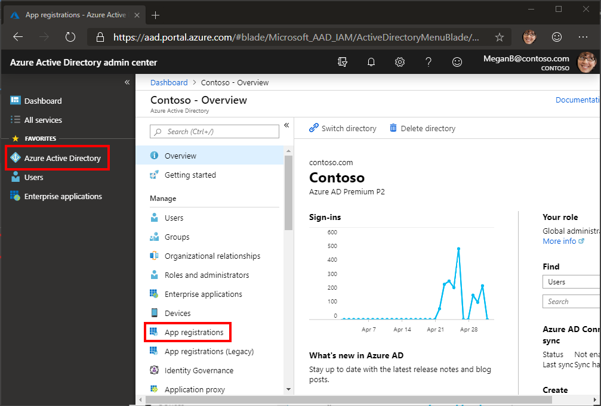

<!-- markdownlint-disable MD002 MD041 -->

Dans cet exercice, vous allez créer une application native Azure AD à l’aide du centre d’administration Azure Active Directory.

1. Ouvrez un navigateur, accédez au [Centre d’administration Azure Active Directory ](https://aad.portal.azure.com) et connectez-vous à l’aide d’un **compte personnel** (ou compte Microsoft) ou d’un **compte professionnel ou scolaire**.

1. Sélectionnez **Azure Active Directory** dans le volet de navigation gauche, puis sélectionnez **Inscriptions d’applications** sous **Gérer**.

    

1. Sélectionnez **Nouvelle inscription**. Sur la page **Inscrire une application**, définissez les valeurs comme suit.

    - Définissez le **Nom** sur `Xamarin Graph Tutorial`.
    - Définissez les **Types de comptes pris en charge** sur **Comptes dans un annuaire organisationnel et comptes personnels Microsoft**.
    - Sous **URI de redirection (facultatif)**, remplacez la liste déroulante par **client Public (mobile & Desktop)** et définissez `msauth://com.companyname.GraphTutorial`la valeur sur.

    

1. Sélectionner **Inscription**. Sur la page **Xamarin Graph Tutorial** , copiez la valeur de l' **ID d’application (client)** et enregistrez-la, vous en aurez besoin à l’étape suivante.

    
